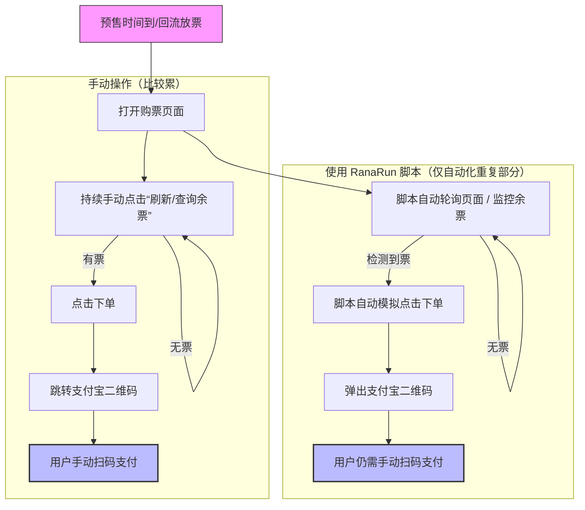

# RanaRun

RanaRun乐奈快跑


**对ComicUP/ALLCPP下单的研究和分析**

**助力每一场漫展的购票，实现每一个二次元的梦想！**

### 注意
**本项目不为盈利/黄牛抢票设计，仅供研究和方便用户快速下单，省去在服务器拥挤时反复手动重试请求的困扰**

- 本项目不提供二进制文件下载，请自行运行代码
- 本项目不允许在整个大陆公开平台广泛宣传，甚至利用本项目引流到私域的行为！！！

**为避免营利性用户使用本工具，我们永远不会开发，亦不接受以下类型的功能PR：**
- 通过本工具对接其他“验证码接收服务”，”授权平台“，接收验证码，注册comicup账号
- 通过本工具向comicup账号内添加，批量添加实名人，修改实名人，通过实名认证
- 自动化的支付宝支付，，一次性导出所有账号的支付链接等
- 其他任何形式给黄牛/规模化使用本工具者带来便利的功能

### 使用流程（对于预售）：
1. 注册ComicUP账号
2. 在**自己的手机上**完成账号配置，包括填写实名信息，软件不提供此功能
3. 在本程序上登录账号，挑一个正在售卖的项目**进行一次下单测试**（重要！必做！）
4. 确认测试成功后，完成预售配置（参考配置教学）
5. 一旦有票后下单，立即扫描弹出的支付宝二维码

### 使用流程（回流）：
1. 注册ComicUP账号
2. 在**自己的手机上**完成账号配置，包括填写实名信息
3. 在本程序上登录账号，**设置下单完成提示音/播放音乐/通知**（重要！）
4. 填写门票信息，以回流模式开始自动化扫描库存，有库存就下单
5. 一旦有票后自动下单，立即扫描弹出的支付宝二维码

### 工作原理：



## 运行方式

### 方式一：WebUI（推荐）

WebUI提供直观的网页界面，支持所有功能，包括环境管理、票务查询、抢票进程管理等。

```bash
# 启动 WebUI 服务器
python webui_server.py

# 或使用自定义端口
python webui_server.py --port 8080

# 或只绑定本地地址
python webui_server.py --host 127.0.0.1 --port 8090
```

启动后访问 `http://localhost:5000`（或你指定的地址）即可使用。

### 方式二：TUI（终端界面）

TUI提供终端交互界面，适合习惯命令行操作的用户。

```bash
# 启动 TUI
python main.py
```

### 环境要求

- Python 3.8+
- 依赖包：`requests`, `flask`, `flask-cors`, `rich` 等

```bash
# 安装依赖
pip install -r requirements.txt
```

### 快速开始

1. **启动 WebUI**：`python webui_server.py`
2. **创建环境**：在网页上点击"创建环境"，填写环境名称
3. **登录账号**：选择环境，点击"登录"，输入手机号和验证码
4. **开始抢票**：
   - **预售模式**：配置活动ID、票种、购买人，设置延迟参数
   - **回流模式**：配置活动ID、票种，设置刷新间隔
5. **查看进程**：在"抢票进程"页面查看和管理所有抢票任务
